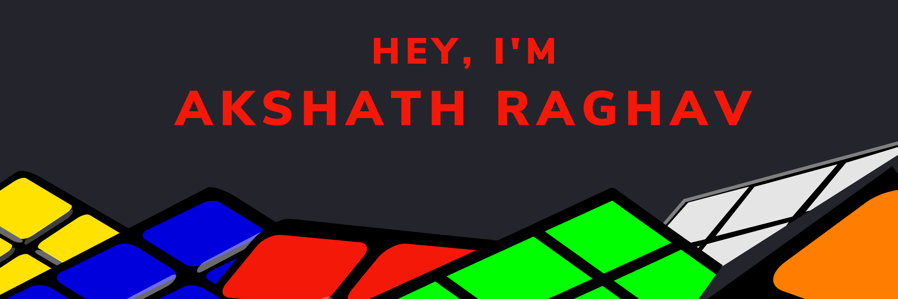

  

 

Hello there 👋

I’m Braydon, a senior full-stack engineer, creative coder and self-proclaimed designer who specializes in front-end development.   
I make it my mission to translate user-focused designs into pixel-perfect websites or applications  
that run blazing fast.
 

## 💼 Skills

## 📌 Pinned Repos

  
  
## &#x1f4c8; GitHub Stats

 

 
 

